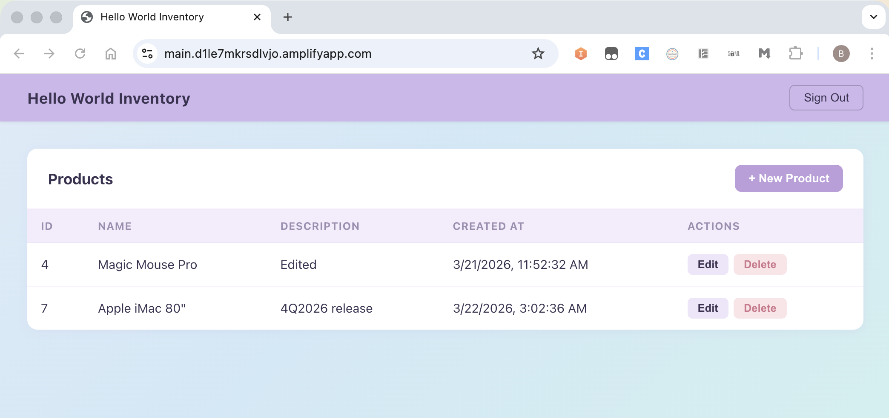

# Deployment Guide

## Prerequisites

| Tool | Install |
|------|---------|
| Node.js (LTS) | https://nodejs.org |
| AWS CLI | https://docs.aws.amazon.com/cli/latest/userguide/getting-started-install.html |
| AWS SAM CLI | https://github.com/aws/aws-sam-cli/releases/latest |
| zip (Mac only) | Pre-installed on macOS |

Verify installations:
```
node -v && npm -v && aws --version && sam --version
```

---

## Hello World Inventory — AWS Amplify + SAM Deployment Demo

This is a ready-to-deploy template that demonstrates how to host a React frontend on AWS Amplify using AWS SAM for infrastructure provisioning — with one-command deploy
scripts for both Windows (PowerShell) and Mac/Linux (Bash). No Git-based CI/CD pipeline required.

What this template demonstrates:
- Defining an Amplify app and branch as infrastructure-as-code using SAM/CloudFormation
- Deploying a pre-built React app to Amplify via CLI upload
- Cross-platform deployment: deploy-frontend.ps1 for Windows, deploy-frontend.sh for Mac/Linux
- Resource tagging for cost tracking and governance

Included application features:
- Cognito authentication with persistent login sessions
- Product CRUD operations via API Gateway + Lambda backend
- Mock mode for offline development without a backend

Architecture:
- **Hosting:** AWS Amplify (manual deployment, no Git required)
- **Auth:** Amazon Cognito
- **Backend:** API Gateway + Lambda (separate stack)
- **Infrastructure:** SAM template (template.yaml)

## Step 1 — Configure AWS Credentials (SSO)

Run the SSO configuration:
```
aws configure sso
```

Follow the prompts as shown below:
```
SSO session name (Recommended): user1-playground
SSO start URL [None]: https://d-9667a65e00.awsapps.com/start
SSO region [None]: ap-southeast-1
SSO registration scopes [sso:account:access]:
```

A browser window will open for you to authorize. After approval, continue:
```
The only AWS account available to you is: 876908012372
Using the account ID 876908012372
The only role available to you is: DeveloperAccess
Using the role name "DeveloperAccess"
Default client Region [ap-southeast-1]:
CLI default output format (json if not specified) [None]:
Profile name [DeveloperAccess-876908012372]: default
```

> **Tip:** Name the profile `default` so you don't need `--profile` on every command. Otherwise, use a custom name and pass `--profile yourname` to all commands.

Verify your configuration:
```
aws sts get-caller-identity
```

**Login before each session:**
```
aws sso login
# or with named profile
aws sso login --profile myprofile
```

---

## Step 2 — Download and Extract Source Code

Download `tg-frontend.zip` and extract it.

**Mac/Linux:**
```bash
unzip tg-frontend.zip
cd tg-frontend
```

**Windows (PowerShell):**
```powershell
Expand-Archive -Path tg-frontend.zip -DestinationPath .
cd tg-frontend
```

You should see this structure:
```
tg-frontend/
├── template.yaml
├── deploy-frontend.sh
├── deploy-frontend.ps1
└── hello-world/
    ├── src/
    ├── public/
    ├── package.json
    └── .env
```

---

## Step 3 — Customize Deployment Parameters

Decide on your values before deploying:

| Parameter | Description | Example |
|-----------|-------------|---------|
| Stack Name | CloudFormation stack name (must be unique per account/region) | `demo-tg-frontend-john-dev` |
| Project | Project identifier (used in Amplify app name) | `demo-tg-frontend-john` |
| Environment | Deployment environment | `dev`, `staging`, `prod` |
| FunctionCode | Cost center / function code | `5A`, `5B`, `5C`, `5D`, `TD`, `5DB`, `D5A` |
| ITSupport | Your name (IT support contact) | `John` |
| ApplicationName | Display name for the application | `Hello World` |

> **Important:** Stack name and Project must be unique per AWS account/region. Include your name as a suffix to avoid conflicts with other users (e.g., `demo-tg-frontend-john-dev`).

---

## Step 4 — Deploy Backend (SAM)

This creates the Amplify app and branch via CloudFormation.

**Mac/Linux:**
```bash
# Default profile
sam deploy \
  --template-file template.yaml \
  --stack-name <STACK_NAME> \
  --region ap-southeast-1 \
  --capabilities CAPABILITY_IAM \
  --parameter-overrides \
    "Project=<PROJECT>" \
    "Environment=<ENVIRONMENT>" \
    "FunctionCode=<FUNCTION_CODE>" \
    "ITSupport=<IT_SUPPORT>" \
    "ApplicationName=<APPLICATION_NAME>"

# Named profile
sam deploy \
  --template-file template.yaml \
  --stack-name <STACK_NAME> \
  --region ap-southeast-1 \
  --capabilities CAPABILITY_IAM \
  --profile myprofile \
  --parameter-overrides \
    "Project=<PROJECT>" \
    "Environment=<ENVIRONMENT>" \
    "FunctionCode=<FUNCTION_CODE>" \
    "ITSupport=<IT_SUPPORT>" \
    "ApplicationName=<APPLICATION_NAME>"
```

**Windows (PowerShell):**
```powershell
# Default profile
sam deploy `
  --template-file template.yaml `
  --stack-name <STACK_NAME> `
  --region ap-southeast-1 `
  --capabilities CAPABILITY_IAM `
  --parameter-overrides `
    "Project=<PROJECT>" `
    "Environment=<ENVIRONMENT>" `
    "FunctionCode=<FUNCTION_CODE>" `
    "ITSupport=<IT_SUPPORT>" `
    "ApplicationName=<APPLICATION_NAME>"

# Named profile
sam deploy `
  --template-file template.yaml `
  --stack-name <STACK_NAME> `
  --region ap-southeast-1 `
  --capabilities CAPABILITY_IAM `
  --profile myprofile `
  --parameter-overrides `
    "Project=<PROJECT>" `
    "Environment=<ENVIRONMENT>" `
    "FunctionCode=<FUNCTION_CODE>" `
    "ITSupport=<IT_SUPPORT>" `
    "ApplicationName=<APPLICATION_NAME>"
```

Example using values from Step 3:
```
sam deploy --template-file template.yaml --stack-name demo-tg-frontend-john-dev --region ap-southeast-1 --capabilities CAPABILITY_IAM --parameter-overrides "Project=demo-tg-frontend-john" "Environment=dev" "FunctionCode=5D" "ITSupport=John" "ApplicationName=Hello World"
```

---

## Step 5 — Get the Amplify App ID

The App ID is shown in the SAM deploy output:

```
CloudFormation outputs from deployed stack
---------------------------------------------------------------------------
Outputs
---------------------------------------------------------------------------
Key                 AppId
Description         -
Value               d1le7mkrsdlvjo

Key                 DefaultDomain
Description         -
Value               https://main.d1le7mkrsdlvjo.amplifyapp.com
---------------------------------------------------------------------------
```

Note the **AppId** value (e.g., `d1le7mkrsdlvjo`) — you'll need it in Step 7.

If you missed it, you can retrieve it later:

**Mac/Linux:**
```bash
aws cloudformation describe-stacks \
  --stack-name <STACK_NAME> \
  --region ap-southeast-1 \
  --query "Stacks[0].Outputs" \
  --output table \
  --no-cli-pager

# With named profile
aws cloudformation describe-stacks \
  --stack-name <STACK_NAME> \
  --region ap-southeast-1 \
  --query "Stacks[0].Outputs" \
  --output table \
  --profile myprofile \
  --no-cli-pager
```

**Windows (PowerShell):**
```powershell
aws cloudformation describe-stacks `
  --stack-name <STACK_NAME> `
  --region ap-southeast-1 `
  --query "Stacks[0].Outputs" `
  --output table `
  --no-cli-pager

# With named profile
aws cloudformation describe-stacks `
  --stack-name <STACK_NAME> `
  --region ap-southeast-1 `
  --query "Stacks[0].Outputs" `
  --output table `
  --profile myprofile `
  --no-cli-pager
```

Note the **AppId** value (e.g., `d2139yu6c0ysj6`).

---

## Step 6 — Configure Environment

Edit `hello-world/.env` with your backend settings:

```
REACT_APP_COGNITO_CLIENT_ID=your_cognito_client_id
REACT_APP_API_GATEWAY_URL=https://your-api-id.execute-api.ap-southeast-1.amazonaws.com/dev
REACT_APP_USE_MOCK=false
REACT_APP_USE_AUTH=true
```

> These values are baked into the app at build time. Always update `.env` before building.

---

## Step 7 — Build and Deploy Frontend

**Mac/Linux:**
```bash
# Default profile
./deploy-frontend.sh YOUR_APP_ID

# Named profile
./deploy-frontend.sh YOUR_APP_ID myprofile
```

**Windows (PowerShell):**
```powershell
# Default profile
.\deploy-frontend.ps1 -AppId YOUR_APP_ID

# Named profile
.\deploy-frontend.ps1 -AppId YOUR_APP_ID -Profile myprofile
```

Your app will be live at: `https://main.YOUR_APP_ID.amplifyapp.com`

---

## Appendix: Example Build and deploy command output

```
PS C:\development\tg-frontend> .\deploy-frontend.ps1 d1le7mkrsdlvjo

Security warning
Run only scripts that you trust. While scripts from the internet can be useful, this script can potentially harm your
computer. If you trust this script, use the Unblock-File cmdlet to allow the script to run without this warning
message. Do you want to run C:\development\tg-frontend\deploy-frontend.ps1?
[D] Do not run  [R] Run once  [S] Suspend  [?] Help (default is "D"): R
1/4 Installing dependencies...

...

2/4 Building...

> build
> react-scripts build

(node:26096) [DEP0176] DeprecationWarning: fs.F_OK is deprecated, use fs.constants.F_OK instead
(Use `node --trace-deprecation ...` to show where the warning was created)
Creating an optimized production build...
Compiled successfully.

File sizes after gzip:

  101.97 kB  build\static\js\main.69877982.js
  1.59 kB    build\static\js\963.1163e1d0.chunk.js
  1.44 kB    build\static\css\main.46102120.css

The project was built assuming it is hosted at /.
You can control this with the homepage field in your package.json.

The build folder is ready to be deployed.
You may serve it with a static server:

  npm install -g serve
  serve -s build

Find out more about deployment here:

  https://cra.link/deployment

3/4 Creating deployment...
Zipping build...
Uploading...

Upload complete.
4/4 Starting deployment...
{
    "jobSummary": {
        "jobArn": "arn:aws:amplify:ap-southeast-1:876908012372:apps/d1le7mkrsdlvjo/branches/main/jobs/0000000003",
        "jobId": "3",
        "status": "PENDING"
    }
}

Done! https://main.d1le7mkrsdlvjo.amplifyapp.com
PS C:\development\tg-frontend>

```

## Subsequent Deploys

After code changes, just re-run Step 7. No need to repeat Steps 4–6.

---

## Troubleshooting

| Issue | Fix |
|-------|-----|
| PowerShell: "running scripts is disabled" | `Set-ExecutionPolicy -ExecutionPolicy RemoteSigned -Scope CurrentUser` |

## Screenshots


## Additional info

template.yaml — SAM/CloudFormation template
- Creates an Amplify App and a main branch
- Tags resources with Project, Environment, FunctionCode, ITSupport, ApplicationName for governance
- Outputs the App ID and URL after deploy

hello-world/src/ — React app source

index.js → Entry point. Renders <App /> into the DOM.

App.js → Main component. Handles two states:
- Not logged in → shows login form, calls login() from auth.js
- Logged in → shows navbar + <ProductList />
- Checks localStorage on load so refreshing doesn't lose the session

auth.js → Cognito authentication:
- login(username, password) → calls Cognito InitiateAuth API, stores the ID token in localStorage
- getCurrentToken() → returns the stored token (used by api.js for API calls)
- logout() → clears the token

api.js → API layer:
- If REACT_APP_USE_MOCK=true → returns hardcoded mock data (no backend needed)
- Otherwise → calls the API Gateway URL from .env, attaches the Cognito token as Bearer auth header

ProductList.js → CRUD UI:
- Fetches products from /items on load
- Table with Edit/Delete buttons per row
- "New Product" button opens a modal form (ProductModal)
- Edit also opens the modal pre-filled with existing data
- Calls POST /items, PUT /items/:id, DELETE /items/:id via api.js

hello-world/.env — Config baked into the app at build time:
REACT_APP_COGNITO_CLIENT_ID=...     # Cognito app client
REACT_APP_API_GATEWAY_URL=...       # Backend API endpoint
REACT_APP_USE_MOCK=false            # true = skip backend, use fake data
REACT_APP_USE_AUTH=true             # true = require login


Deploy scripts — both do the same thing:
1. npm install + npm run build → produces build/ folder
2. aws amplify create-deployment → gets a presigned upload URL
3. Zip the build/ folder (bash uses zip, PowerShell uses tar)
4. Upload the zip to the presigned URL
5. aws amplify start-deployment → triggers Amplify to serve the new build

Flow:
User → deploy script → npm build → zip → upload to Amplify
User → browser → Amplify CDN → React app → login via Cognito → API Gateway → Lambda → DB
